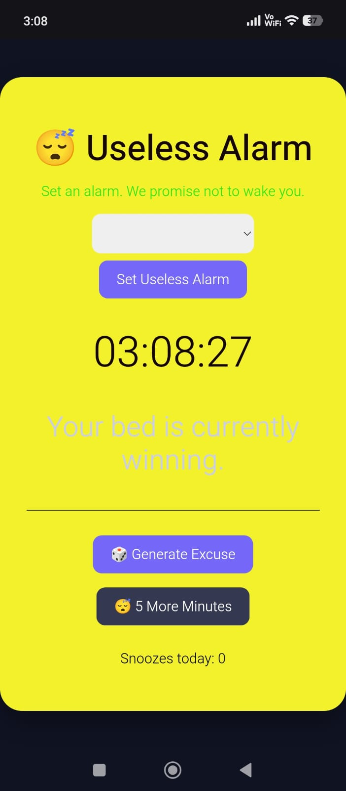
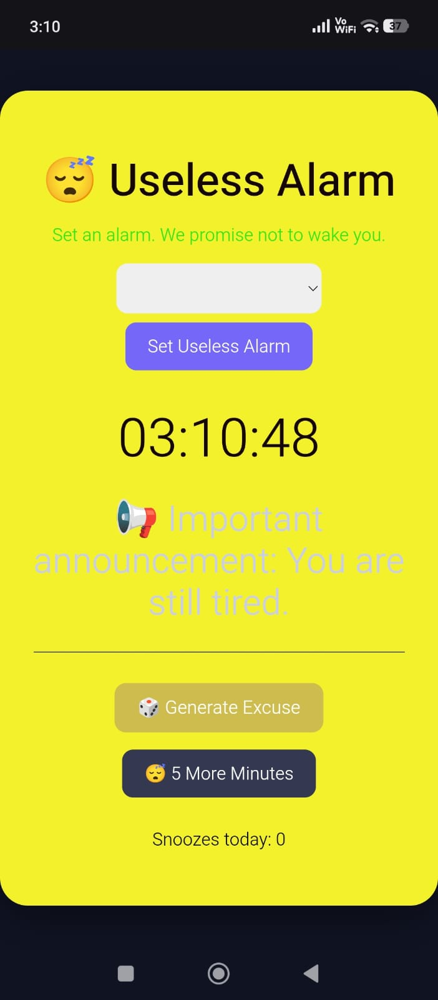
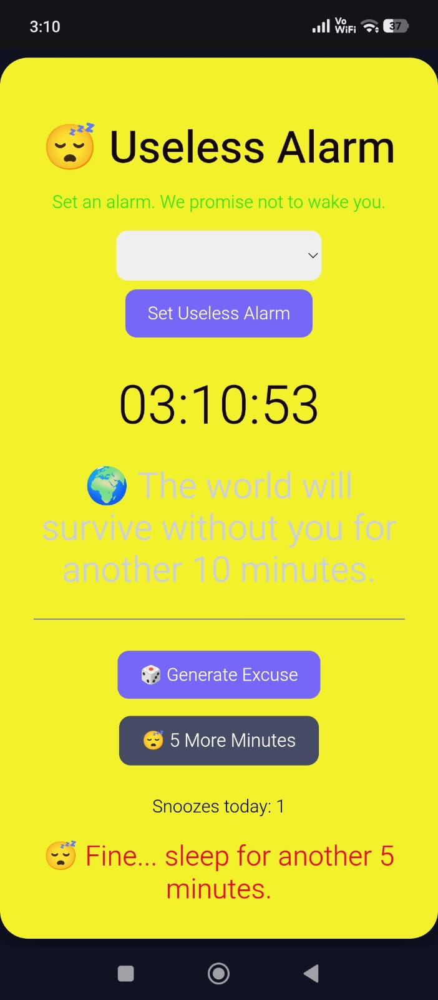

# Useless Alarm 🎯

## Basic Details
### Team Name:Buildx

### Team Members
- Team Lead: Riswin p - Coe Trikaripur
- Member 2: Akshay kv - Coe Trikaripur

### Project Description
A simple and fun "Useless Alarm" web app built with HTML,CSS and JAVASCRIPT.It lets users set an alarm ,but instead of making a sound,it displays a funny message encouraging them to sleep.

### The Problem (that doesn't exist)
The problem is sound of the alarm.

### The Solution (that nobody asked for)
Instead of making sound, it displays a funny message encouraging them to sleep for five more minutes.

## Technical Details
### Technologies/Components Used
For Software:
-HTML,CSS,JAVASCRIPT

### Project Documentation
For Software:

# Screenshots (Add at least 3)

*Add caption explaining what this shows*

*Add caption explaining what this shows*

*Add caption explaining what this shows*

# Diagrams

*Add caption explaining your workflow*

### Project Demo
# Video

https://github.com/user-attachments/assets/4274c51f-44d6-40b8-a38d-4b6da4081777

## Team Contributions
- RISWIN P:Idea contribution and helping in implementation
- AKSHAY KV: Implementation and helping for creating idea

---
Made with ❤️ at TinkerHub Useless Projects 

